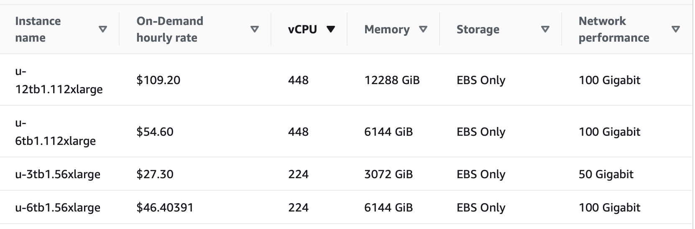

# Lecture 9

## Model Evaluation
## Scarcity and Abundance of Data

---

## What is model evaluation about?

- Classification of uncertainties
    - In the model (i.e. model parameters)
    - Resulting uncertainties in predictions
    - Resulting uncertainties in performance measures

---

## Where do the uncertainties come from?

- Data
    - Variance (from small data sets)
    - Bias (often also from small data sets)
    - But, remember the $\sqrt{N}$ law!
- Model
    - Inability to capture the nature of the data (i.e. non-linear data)
- Modeling process
    - E.g. choice of train, test, and *validation* sets

---

## How to deal with them?

- Cross-validation (dependence of performance on train/test choice)
    - Extreme case: Leave-one-out CV
- Bootstrapping
    - Swiss army knife
- Direct calculation of errors on model parameters (in some cases)
    - E.g. linear regression
- Many models can predict "probabilities"
    - E.g. Logistic regression, decision trees

---

# Scarcity and Abundance of Data

---

## Compute Availability

- Historically, expensive on-premise hardware was required
- High capital expenditure (CAPEX), high operating expenditure (OPEX)
    - Difficult to make a case to invest
- Now: Cloud services available

---

## Scarcity of data

- High potential for bias
- Often limited model performance
- High variance
- Makes things like leave-one-out CV feasible

---

## Abundance of Data

- Data engineering and tooling becomes very important
- Cost becomes an issue
    - Training cost of GPT-4: est. 100 MUSD
- Modern frameworks like Spark do much of the heavy lifting
- Common issues
    - Rare cases become more probable to be in a large datasets
    - Irregularities with data (outliers, missing data) becomes more common
        - Outliers harder to identify