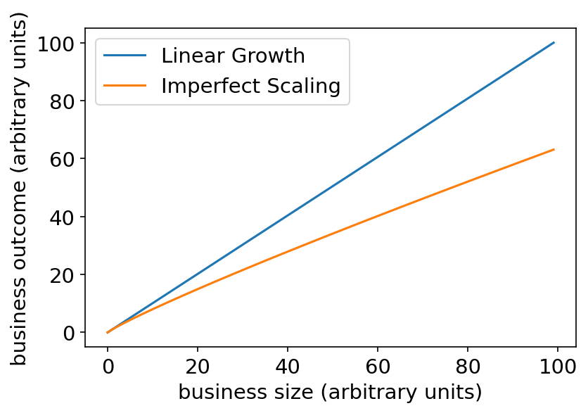
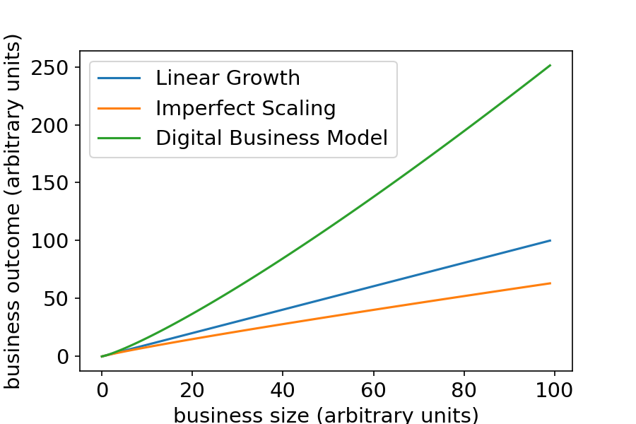
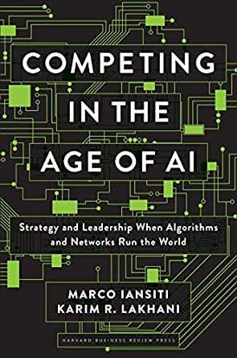

# Welcome to IN-STK 5000/9000
### Autumn 2022

---

## Course Mechanics

%%%

- Weekly sessions
  - Lecture 12:05 - 14:00
  - Exercises 14:15 - 15:50
  - Guest lectures
	- GDPR Expert
	- Equinor Data Scientist
- Two projects
  - Coordinated with course content
  - Presentation and hand-in
	- Will help you to work on your presentation skills
  - Graded 50% presentation, 50% hand-in
- Final exam

%%%

---

## Your Lecturers

- Anne-Marie George
- Dirk Hesse
  - VP Technology Management at Equinor
  - Adjunct Associate Professor at UiO

## Teaching Assistant

- Roxana Pop

---

## What this course is about

%%%

- Data Science includes
  - Statistics
  - Computer Science
  - Business Understanding
  
This course deals with the **interfaces of and overlaps** between
computer science, statistics, and business (decision making)
concepts. How does one, using statistical methods and CS concepts,
take sound business decisions?

We will also work on communication and presentation.

%%%

---

## The Importance of Presentation Skills

%%%

- Data Science is by definition a multidisciplinary activity
- Key to your success will be to communicate difficult concepts
  clearly to people with diverse backgrounds
  
%%%

---

## Trust in AI

%%%

- Lack of trust in machine learning methods stands in the way of broad
  adoption
- Good communication skills help you to build trust
- Some of the methods discussed in the lectures address this
  - Fairness
  - Privacy
  - Reproducibility
  - Explainability
  
  
%%%

---

## Why Data-Driven Decision Making?

%%%

- In traditional business models humans take most decisions
- This doesn't *scale* well
  - Making more decisions takes more employees, and costs more
	- E.g. selling more loans
	- Shipping more products
- Business outcomes scale linearly in classical business models
  - Often even worse-than-linear due to inefficiencies at scale

%%%

---

## Digital Business Models

%%%

- In digital businesses, processes are highly automated
- Digital agents can be duplicated at almost zero marginal cost
- Decisions get better the more *data* is available
- Thus, business outcomes scale *much* better than linearly.
  - Ref. also *network* effects

%%%

---

## Side Remark: Network Effects

%%%

- Digital Businesses perform better the more *data* they have
  - More data leads to better models, which lead to better decisions
- This generates positively reinforcing dynamics
  - The more customers, the better the customer experience
	- The better the customer experience, the more customers
- Social networks obey a similar dynamic
  - The more users are on in the more attractive they become
  
%%%

---

## A Few Words on Business Understanding

%%%

- Understanding the aim of automating decision making is
  *context dependent*.
- Hard to teach specifics ...
- We will however see how a specific business context can be
  approached and what questions a data scientist should ask.
- This is equally important in industry and many areas in academia.

%%%

---

## The Business Case

%%%

%%%

- A **business objective** can be many things
  - Profit in a public company
  - Maximise the number of people saved by vaccine
  - Remove maximum amount of CO2 from a process
- A **business case** is a prescription of how to achieve the business
  objective in a project or activity

---

## An Example

Let's assume we're given a classification task. There are different
kinds of classification errors we can make.

<table style="text-align: center; position: relative; right: 5vw">
	<tr>
		<th colspan=2></th>
		<th colspan=2>
		Actual outcome</th>
	</tr>
	<tr>
		<th colspan=2></th>
		<th>Positive</th>
		<th>Negative</th>
	</tr>
	<tr>
		<th rowspan=2 style="transform: rotate(270deg); position: relative; left: 5vw">Prediction</th>
		<th>Positive</th>
		<td style="background-color: green">True Positive</td>
		<td style="background-color: red">False Positive</td>
	</tr>
	<tr>
		<th>Negative</th>
		<td style="background-color: red">False Negative</td>
		<td style="background-color: green">True Negative</td>
	</tr>
</table>

---

## An Example (cont.)

A false positive does often not come at the same cost as a
false negative, e.g.

- Tests for disease (e.g. Covid rapid tests)
- Tests for more serious disease such as hepatitis
- A system making loan decisions
- A system given recommendations for granting parole

Part of a business case could be

- How many infections will we prevent?
- How many people will get the right treatment?
- How much money will we earn on loans?
  - How much do we stand to loose (ref. value-at-risk)?
- How many people will we falsely imprison?

These considerations are part of a **business case**.

---

## A Word About Metrics and KPIs

- Projects in business are usually followed up by *metrics*
  - Metrics quantify certain aspects of the success of a project
- Key metrics that track overall success are called *Key Performance
  Indicators* (KPIs)
  - Good KPIs are directly linked to value creation
- Ideally one tracks the outcome of data-driven decision making with a
  KPI
  - Related concept: Reward functions and utility (from reinforcement
    learning)
  - WARNING: Utility functions usually don't make for very good KPIs
  - They track mostly only part of the overall outcome

---

### How We Cover the Business Side:

# The Projects!

- Take them seriously!
- Don't just seen them as a data exercise!
  - Really think about the underlying business case.

---

## The Basic Tools

Today, we will start with introducing some basic tools used during the
lectures

- `Python`
- `Jupyter`
- `Pandas`
- `Scikit-learn` (if time allows)

---

## Python

%%%

- More specifically: Python 3.10
  - You have several options: **Pyenv**, Hombrew/other PMs, Anaconda, ...
- You should be somewhat familiar with programming
  - Ideally in Python
- Work in groups, learn from each other
- If you don't know python:
[Dive Into Python 3](https://diveintopython3.problemsolving.io)
- Why?
  - Real programming language
  - Widely used
    - You can get help
    - Makes you hirable
  - Plenty fast for us
- Get a good text editor (VSCode, Emacs, Vim ...)

%%%

---

## Jupyter

%%%

- Jupyter lab will be used for teaching (the practical bits)
- Graphical
- Interactive
- Great tool for exploring and teaching
- For any serious work, use a script instead!
  - In particular, for your assignments
  - Think about writing some tests

%%%

---

## Some remarks

- CS, Stats, Business - there's a lot to understand/work on
  - It's also hard to teach: Give feedback!
	- We can't read your mind!
- The course *will be challenging*
- Ask questions!

