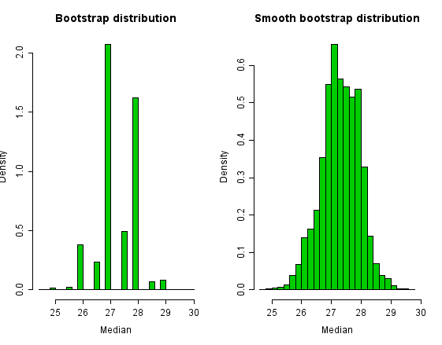

# IN-STK 5000 Session 10

## Bandits and Model Interpretation

---

# Multi-Armed Bandits

%%%

Set of real distributions $B = \left\{R_1,\ldots,R_K\right\}$, each
associated with rewards delivered by one of $K$ levers. Each action
generates a reward $r_t$. $\mu_k = E(R_k)$. Regret is defined as

$$\rho = T \mu^* - \sum_{t=1}^T \hat r_t\,.$$

%%%

---

# Multi-Armed Bandits

%%%

Relevant for many applications, e.g. 

* Clinical trials
* Adaptive routing
* Financial portfolio design

%%%

---

# Bandits: Strategies

If action $a$ chosen, and reward $r$ received, update

$\alpha_a \to \alpha_a + r, \quad \beta_a \to \beta_a +
(1-r)$. Probability model $\hat \theta = \alpha / (\alpha + \beta)$.

* Greedy
  * Explore phase, then exploit
* Epsilon-greedy
  * Choose random action with probability $\epsilon$
* Probability matching (e.g. Thompson Sampling)
  * Choose action according to probability model

---

# Bootstrapping

%%%

Resample sample data to allow inference of statistical properties of
original distribution. 

1. Start with $N$ samples $\hat X$.
2. Draw $M$ bootstrap samples $\hat B_i, i=1,\ldots,M$ of size $N$,
   with replacement.
3. Obtain $M$ values for a statistic $f_i = F(\hat B_i)$ of interest.
4. Use those to e.g. estimate confidence intervals.

%%%

