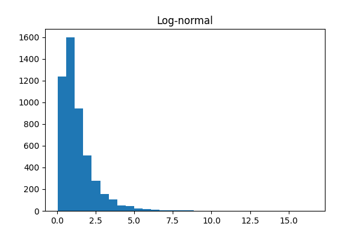

# Session 06

## Outliers (finishing up) and privacy in action

---

# Outliers

- We'll be looking at outliers in the bysykkel data. 
- We'll be looking for a appropriate distribution to model trip
  duration
- We'll do clustering on the trip data (mainly to use more of Sklearn)

---

## Log-normal distribution

Reminder: If $X$ is log-normal distributed, then

$$Y = \operatorname{ln}(X)$$

is normal distributed.

---

## Chi-square distribution

Reminder: If $Z_i, i = 1,\ldots,k$ are normal distributed, then

$$Y = \sum_i X_i^2$$

is $\chi^2$ distributed.

Not normally used to model observations, but for hypothesis testing
and confidence intervals.

---

# Privacy: Randomization

---

## $\epsilon$-differential privacy

Let $\epsilon$ be positive, real, and $\mathcal{A}$ be a randomized
algorithm. $\mathcal{A}$ provides $\epsilon$-differential privacy if
for all $D_1$, $D_2$ that differ by one element, and all subsets S of
$\operatorname{im}\mathcal{A}$

$$\operatorname{Pr}[\mathcal{A}(D_1) \in S] \leq 
\operatorname{exp}(\epsilon) \cdot
\operatorname{Pr}[\mathcal{A}(D_2) \in S] $$

$\epsilon$-differential privacy gives strong guarantees regarding
strength and robustness.

### Intuition

Give each individual roughly the same privacy that would
result from having their data removed from the set.

---

## Randomization

Given a sensitive (binary) variable and a person queried about that
variable,

1. Toss a coin.
2. If heads up, answer honestly.
3. Else, answer randomly by coin toss.

This mechanism provides $\epsilon$-differential privacy, excluding
micro-data releases.
